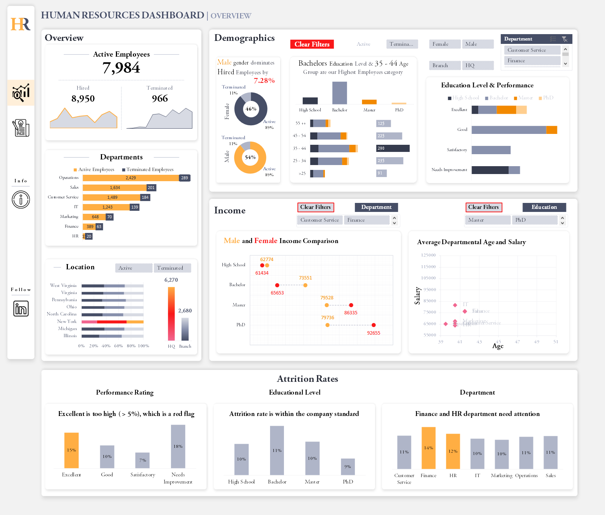
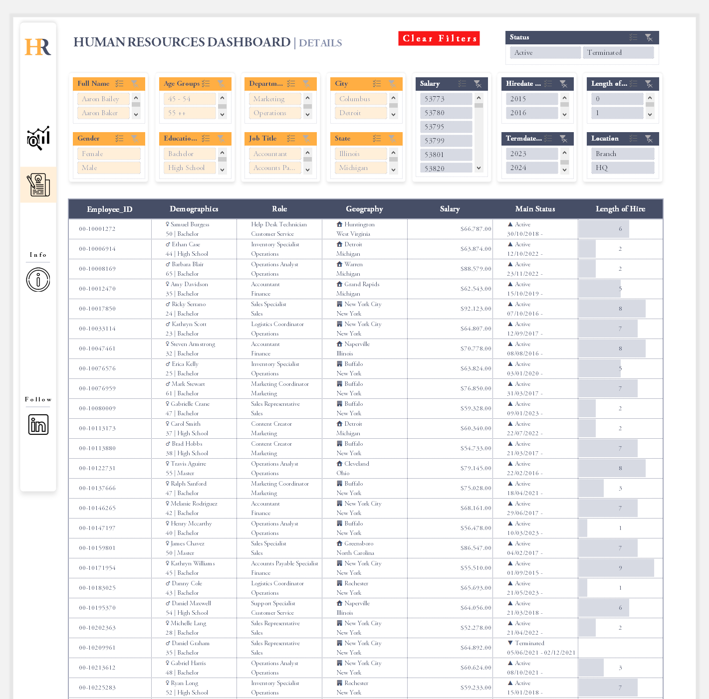

# Excel Human Resources Project

## Project Overview
This is a comprehensive HR Data Analytics project to analyze human resources data, in order to provide summary views for high-level insights and detailed employee records for in-depth analysis

## Table of Contents
- [Data Source](#data-source)
- [Exploratory Data Analysis](#exploratory-data-analysis)
- [Tools and Skills Used](#tools-and-skills-used)
- [Data Analysis](#data-analysis)
- [Results/Findings](#results-and-findings)
- [Recommendations](#recommendations)
- [Limitations](#limitations) 

## Data Source
**HumanResources.csv** - This is the primary resource used for the analysis and it has all the information needed.

## Exploratory Data Analysis
  - This is the link to the Problem Statement. [Click Here](https://www.datawithbaraa.com/tableau/tableau-hr-project-thank-you/)
#### 1. Summary View.
This is divided into four main sections: **Overview**, **Demographics**, **Income**, and **Attrition Rates** (Bonus)
#### 2. Employee Records View
This provides a comprehensive list of all employees with necessary information such **Name**, **Department**, **Position**, **Gender**, **Age**, **Education**, and **Salary**. 
Users should be able to filter the list based on any of the available columns.

## Tools and Skills Used
1. **Power Query**
    - Data Cleaning/Preparation
    - Data loading and inspection
    - Data modification and formatting
3. **DAX** - Performed advanced calculations and queries for needed measures.
4. **Pivot Table** - Analyzed key metrics and summarised data.
5. **Data Visualization techniques** - Developed 2 dashboards, and with slicers for filtering data by various categories

## Data Analysis
#### Summary View Dashboard
This is the Summary View Dashboard showing information on the **Overview, Demographics, Income** and **Attrition** rate of employees.

#### Details View Dashboard
This dashboard provides a comprehensive details of all the analysis data. It includes multiple slicers, allowing HR managers to filter and refine information based on their specific needs. With a single click, you can clear all applied filters and reset the view. The design is user-friendly, with clear icons to help you quickly interpret the data and make informed decisions.

## Results and Findings
The company has **7984** **Active employees** and **70%** of these workers are working at the Headquaters (New York).
#### 1. Gender Employment Diversity Analysis
- **Male** gender dominates totally hired employees by **7.28%**.
- There is no gender disparity in the percentage retention and termination of employees as the organization has equal percentage of **Active (89%)** and **Terminated (11%)** employees for both genders.
#### 2. Distribution of *Active* Employees
- **Education** - *Bachelor* holders has the highest number of employees *(60%)*, and there are more *Male* than *Female* employees in each educational level.
- **Age Group** - *35 - 44* age group are the highest employee category *(31%)*.
- **Department** - *Operations* department has the highest employee *(30%)*, while the least is the *HR* department *(2%)*.
- **Gender** - *54%* employees are *Male* while *46%* employees are *Female*.
#### 3. Active Employee Performance Rating
|Performamce|Highest Rating|Lowest Rating|
|-----------|--------------|-------------|
 Excellent|PhD - 48%|Bachelor - 12%|
|Good|Bachelor - 50%|High School - 21%|
|Satisfactory|High School - 32%|PhD - 13%|
Needs Improvement|High School - 34%|Masters - %5%|

#### 4. Income - Compensation Analysis
- **Educational Level** 
**Male** employees earn higher for **High School** and **Bachelor** holders. However, **Female** employees earn higher as they advance in the **Educational level** as **Female Masters** and **Ph.D** holders earn than the Male counterpart.
- **Age and Salary**  
Department with the highest average salary for Hired employees is the **IT** department, which is **$81926** and the average age is **40** years. Additionally, there's a filter option to analyze this based on the educational level.

#### 5. Attrition Rates
- ##### Perfomance Ratings
  - **Top Performers (Excelllent - 15%, Good - 10%)** 
**Excellent - 15%** - This is a big concern as the organization is loosing the best performing workers, which is not good for the company health.
  - **Low Performers (Satisfactory - 7%, Needs Improvement - 18%)**
- ##### Educational Level
  The attrition rate is within company standard.
- ##### Department
  There is need to address **Finance** and **HR** rates as they are above company standards.

## Recommendations
1. The company should address the wag gap between Male and Female employees.
2. The organization should continously monitor and address the root causes of high attrition. This is because high (voluntary and involuntary) attrition among top performers is a red flag. For a healthy workforce, the organization should ensure top performers are retained and lower performers are managed effectiveely. This could be achieved using good retention strategies, performance management and engagement initiatives.

## Limitations
**System Delay** - Excel takes longer time to apply filters when clicked. This is because of the large dataset (8950 rows). Fortunately this can be addressed using BI tools like Tableau or Power Bi, as they are designed to handle large set of data.

